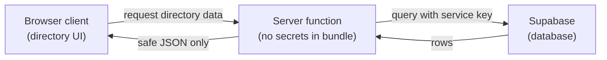

# Client vs Server Inventory -- Hockey Operations Directory

**Related:** docs/boundary-risk-notes.md (Step 1 risks this inventory operationalizes)

## Plain-language model

| Side | Who runs the code? | Who can see it? | Can it hold secrets? |
|------|--------------------|-----------------|----------------------|
| Browser client | The user's device (the directory pages) | Anyone using DevTools / view-source | **No** -- treat everything here as public |
| Server | Machines your team controls | Only your backend and trusted services | **Yes** -- service keys and privileged queries live here |

## 1. Safe on the browser client

- Directory page layout and React components (tables, filters, empty states)
  **Why:** UI must run where the user is. Display data is already exposed once shown on screen.
- User-visible labels, team names, player names already meant for staff display
  **Why:** This data is the whole point of the directory; it is not secret.
- Calling a **server function** endpoint and rendering the JSON it returns
  **Why:** The browser never sees how the data was fetched or what credentials were used.
- Public configuration only (for example a public app name) -- never service keys
  **Why:** Vite inlines `VITE_`-prefixed vars into the bundle; only intentionally public values should use that prefix.

## 2. Must stay on the server

- Supabase **service role** (or any secret) API key
  **Why:** A leaked service key is a full data breach for the directory -- anyone could read or modify rows.
- Creating a privileged Supabase client that bypasses end-user restrictions
  **Why:** The client constructor takes the secret key; if imported from a route/component, Vite bundles it.
- Raw database / RPC reads that use those credentials
  **Why:** The query itself may reveal table structure, but more critically the credential travels with it.
- Any logic that decides "which rows is this caller allowed to see" before a future auth sprint hardens it
  **Why:** Authorization decisions using secret keys belong on trusted infrastructure only.
- Mapping helpers may be pure and shared later, but **credential use** that feeds them stays server-side
  **Why:** Pure mappers have no secrets; the fetch that calls Supabase does.

## 3. Boundary questions still open

- Exactly which public env vars (if any) the Vite client may read vs server-only vars
- Shape of the server-function request/response for directory lists (contract comes in a later step)
- How filters are applied: in the server query vs pure mappers after fetch

## Diagram (keep secrets on the right)

**Rule of thumb:** If leaking it would let a stranger read or change hockey ops data, it belongs on the server side of this picture.

## How I will use this inventory later

- When an agent proposes code, check every new import and env read against sections 1 and 2.
- Reject any client-bundled file that imports server-only modules or secret env names.
- Revisit section 3 when writing the server-function contract and env separation steps.
